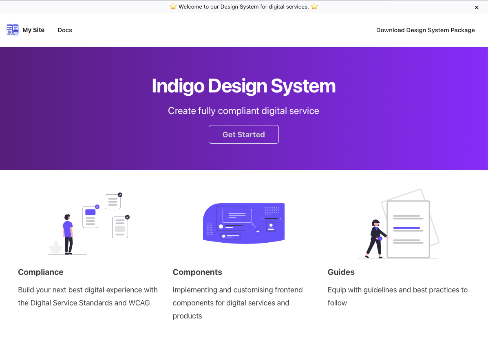
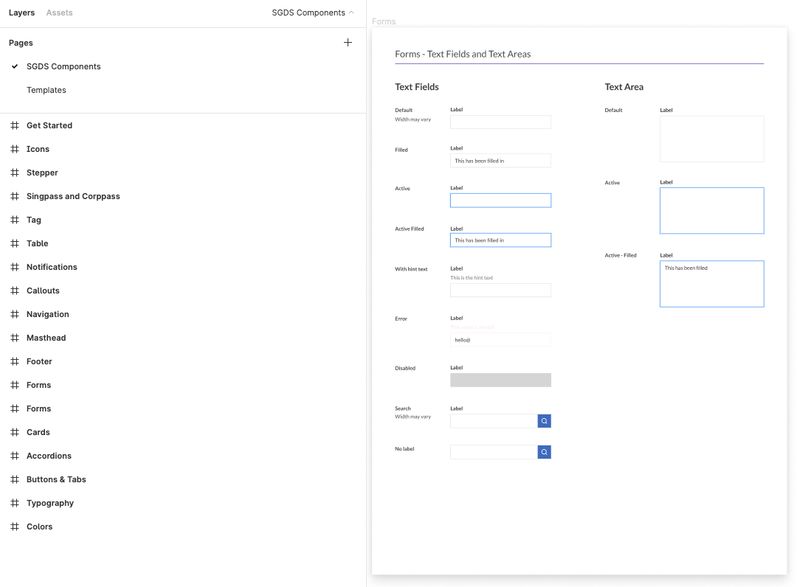

# Indigo Design System

Indigo Design System includes a library UI components for the next digital services. This repository is for the design system code itself.

The design system is built on top of Singapore Design System (SGDS).

It provides a set of DSS guidelines and implementation guide for Sentiments as well as the components that work as the foundation for application development.

## What's inside

- SGDS setup
- Singpass, corppass and myInfo assets
- Payment modes assets [coming soon]
- HTML templates [coming soon]
- Documentation on use of components [coming soon]
- Checklist for DSS [coming soon]

**Structure**
Within the SGDS folder, you will find the following folders:

SGDS/  
├── css/  
├── fonts/  
├── js/

**CSS**

```html
<link rel="stylesheet" href="./css/sgds.css" />
```

## Documentation (Work-in-progress)



## UI Components (Figma)


